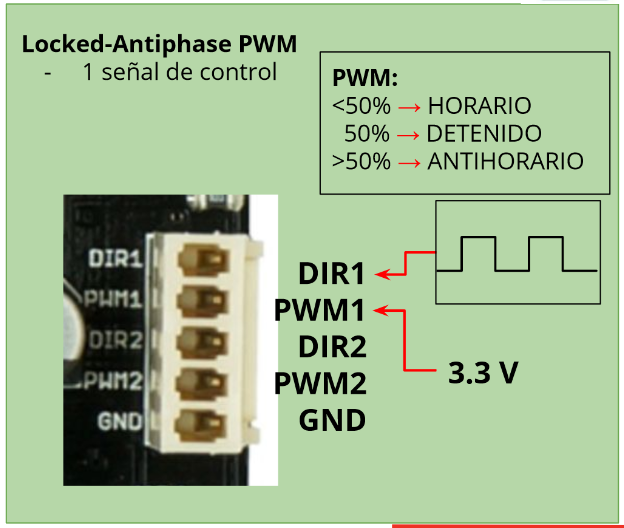

# Trabajo con la tarjeta Cytron MDD10A 
***

Para controlar los motores con las señales PWM se utilizó el tipo de control 
locked_pwm que de acuerdo a lo visto en el [repositorio de ESP32 del TRA](https://github.com/RUVIVAF/esp32-course/blob/master/D4_01_Motores_WiFi/ESP32-D4-Motores_y_WiFi.pdf) la señales de entrada de PWM tiene que tener un ciclo de trabajo determinado para que gire en un sentido o en otro. De acuerdo a la siguiente imagen 

